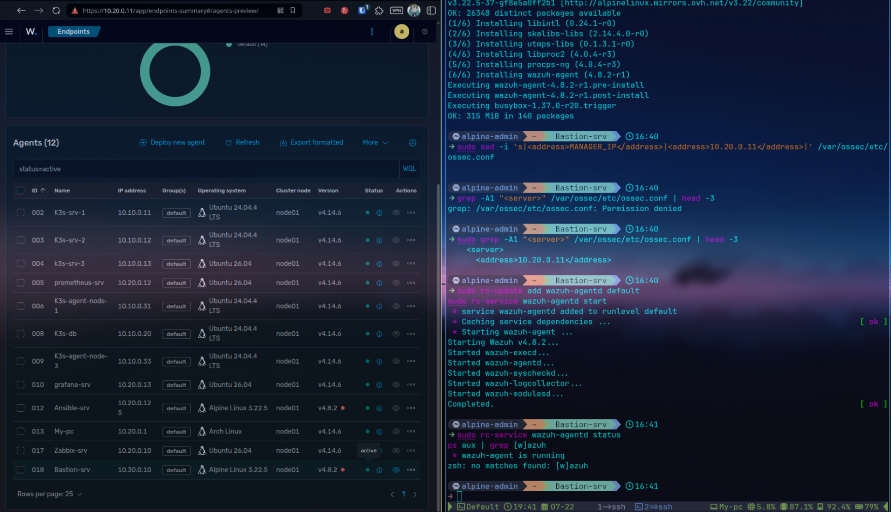
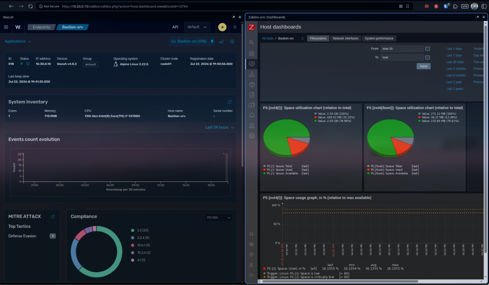

# Monitoring

The bastion is the single entry point into the lab, which makes it the host where visibility matters most. It is enrolled in both monitoring systems of [K3s-lab-monitoring](https://github.com/Souheib-h/K3s-lab-monitoring): Wazuh for security events, Zabbix for resources and availability.

## Wazuh agent

Alpine has no packaged Wazuh agent in its standard repositories, and the Wazuh apk ships no init script — the same situation already solved for the Ansible control node in K3s-lab-monitoring (ADR-010). The install reuses that method: Wazuh's apk repository, the 4.8.x agent, and the custom OpenRC init script from that project.

```bash
# Wazuh apk repository and signing key
echo "https://packages.wazuh.com/4.x/alpine/v3.12/main" | sudo tee -a /etc/apk/repositories
sudo wget -O /etc/apk/keys/alpine-devel@wazuh.com-633d7457.rsa.pub \
    https://packages.wazuh.com/key/alpine-devel%40wazuh.com-633d7457.rsa.pub

sudo apk update
sudo apk add wazuh-agent    # installs 4.8.2

# Point the agent at the manager
sudo sed -i 's|<address>MANAGER_IP</address>|<address>10.20.0.11</address>|' /var/ossec/etc/ossec.conf

# OpenRC init script (reused from K3s-lab-monitoring, configs/ansible/files/wazuh-agentd.initd)
sudo cp wazuh-agentd.initd /etc/init.d/wazuh-agentd
sudo chmod +x /etc/init.d/wazuh-agentd
sudo rc-update add wazuh-agentd default
sudo rc-service wazuh-agentd start
```

The agent enrolls under the VM's hostname and shows up active in the manager:



## Zabbix agent

Simpler: Alpine ships a native `zabbix-agent` package with its own OpenRC service. Only three keys change in the config, matching the pattern used for every other host in the lab.

```bash
sudo apk add zabbix-agent

sudo sed -i \
    -e 's|^Server=.*|Server=10.20.0.10|' \
    -e 's|^ServerActive=.*|ServerActive=10.20.0.10|' \
    -e 's|^Hostname=.*|Hostname=Bastion-srv|' \
    /etc/zabbix/zabbix_agentd.conf

sudo rc-update add zabbix-agentd default
sudo rc-service zabbix-agentd start
```

On the server side, a `Bastion-srv` host is created (Data collection > Hosts > Create host) with the `Linux by Zabbix agent` template and an agent interface on `10.30.0.10:10050`. The host comes up green — both passive checks (server polling the agent) and active checks (agent pushing) work through the router.



## Traffic directions

Both agents push outbound from the bastion (Wazuh on 1514/1515, Zabbix active on 10051), which the router already permits. Zabbix passive polling (server -> bastion on 10050) also works through the routed path. No additional firewall rule was needed.
