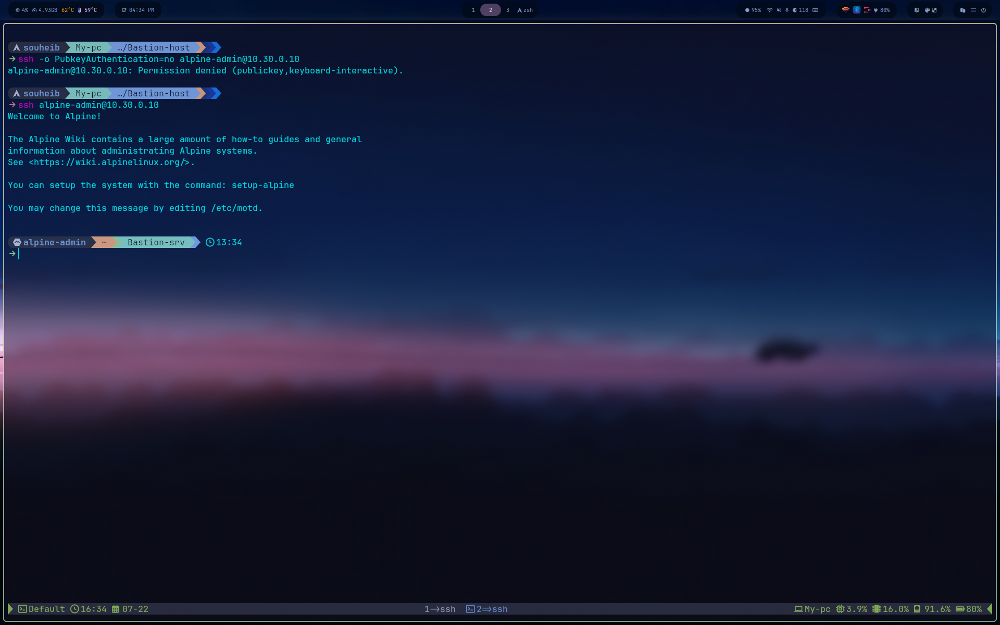
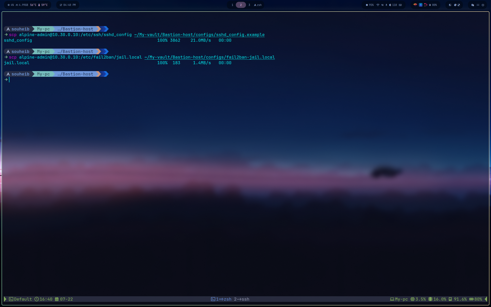
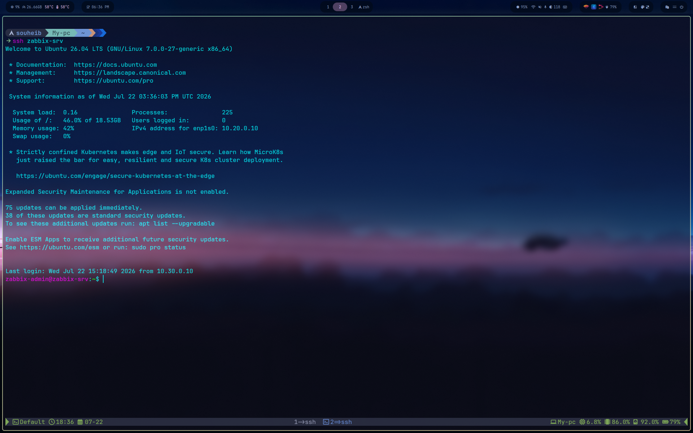

# SSH setup

Server-side hardening and the checks used to confirm each change actually took effect.

## 1. Key-based access

The operator's public key was copied to the VM before any hardening, so a lockout during the next steps couldn't happen without an already-open session as a fallback:

```bash
ssh-copy-id alpine-admin@10.30.0.10
```

## 2. Hardening sshd_config

```bash
sudo cp /etc/ssh/sshd_config /etc/ssh/sshd_config.bak
sudo tee -a /etc/ssh/sshd_config << 'EOF'

# --- Bastion hardening ---
PasswordAuthentication no
PermitRootLogin no
PubkeyAuthentication yes
MaxAuthTries 3
ClientAliveInterval 300
ClientAliveCountMax 2
EOF

sudo sshd -t          # validate syntax before touching the running service
sudo rc-service sshd restart
```

Full file: [`configs/sshd_config.example`](../configs/sshd_config.example)


## 3. Verification — the part that actually matters

Restarting sshd without checking `sshd -t` first can lock you out of the VM with no way back in short of the hypervisor console. Order of operations: validate syntax, restart, then verify from a **second**, separate terminal while the first session stays open.

```bash
# From a fresh terminal, key auth should still work
ssh alpine-admin@10.30.0.10

# Password auth should now be refused
ssh -o PubkeyAuthentication=no alpine-admin@10.30.0.10
```



**Pitfall hit here:** the hardening block was appended twice (a `tee -a` was run twice by mistake), so the file briefly had two duplicate `--- Bastion hardening ---` sections. OpenSSH takes the first occurrence of a duplicated directive, so the service still worked correctly — but the file was cleaned up by restoring `sshd_config.bak` and re-applying the block once, to keep the committed config accurate.

## 4. fail2ban

Installed after confirming key-only access was solid:

```bash
sudo apk add fail2ban
```

Alpine has no `/var/log/auth.log` by default; SSH auth events land in `/var/log/messages` via busybox syslog instead. The jail has to point there, not at the Debian-style path most fail2ban guides assume.

```ini
[DEFAULT]
bantime  = 3600
findtime = 600
maxretry = 3
backend  = auto

[sshd]
enabled  = true
port     = ssh
filter   = sshd
logpath  = /var/log/messages
maxretry = 3
bantime  = 3600
```

Full file: [`configs/fail2ban-jail.local`](../configs/fail2ban-jail.local)

```bash
sudo rc-update add fail2ban default
sudo rc-service fail2ban start
sudo fail2ban-client status sshd
```


Alpine's fail2ban package enables a second jail, `sshd-ddos`, by default alongside `sshd` — a stricter rule against connection floods, kept as-is.

## 5. Pulling the configs into this repo

```bash
scp alpine-admin@10.30.0.10:/etc/ssh/sshd_config configs/sshd_config.example
scp alpine-admin@10.30.0.10:/etc/fail2ban/jail.local configs/fail2ban-jail.local
```



## 6. TCP forwarding

A jump host relays SSH sessions, which requires TCP forwarding. Alpine's sshd disables it by default; the directive is switched to `yes` in the existing line of `sshd_config`:

```bash
sudo sed -i 's/^AllowTcpForwarding no/AllowTcpForwarding yes/' /etc/ssh/sshd_config
sudo sshd -t
sudo rc-service sshd restart
```

Forwarding is still constrained in practice by the router firewall: only `10.30.0.10/32` is allowed into the two lab networks.

Full file: [`configs/sshd_config.example`](configs/sshd_config.example)

## 7. Key strategy, one key per role

Each access path uses its own dedicated key pair:

|Key|Purpose|Authorized on|
|---|---|---|
|`bastion_key`|Operator -> bastion|Bastion-srv only|
|`lab_key`|Operator -> lab hosts|The 13 k3s-net / monitoring-net VMs|
|`ansible-control`|Ansible control node -> managed hosts|The 13 VMs|

```bash
ssh-keygen -t ed25519 -f ~/.ssh/bastion_key -C "operator-to-bastion"
ssh-keygen -t ed25519 -f ~/.ssh/lab_key -C "operator-to-lab-hosts"

ssh-copy-id -i ~/.ssh/bastion_key.pub alpine-admin@10.30.0.10
# lab_key deployed to each lab host the same way
```

The bastion holds no private keys. ProxyJump tunnels authentication from the operator's machine through it, so the bastion only ever relays.

## 8. Client-side ProxyJump

`~/.ssh/config` on the operator's machine:

```
Host bastion
    HostName 10.30.0.10
    User alpine-admin
    IdentityFile ~/.ssh/bastion_key

Host zabbix-srv
    HostName 10.20.0.10
    User zabbix-admin
    ProxyJump bastion
    IdentityFile ~/.ssh/lab_key

Host k3s-srv-1
    HostName 10.10.0.11
    User k3s-admin
    ProxyJump bastion
    IdentityFile ~/.ssh/lab_key
```

Full file: [`configs/ssh-client-config.example`](configs/ssh-client-config.example)

One command, one transparent hop through the bastion:

```
$ ssh zabbix-srv
...
Last login: Wed Jul 22 15:12:13 2026 from 10.30.0.10
```



The `from 10.30.0.10` confirms the session entered through the bastion.

## What's not done yet

- `PermitOpen` restriction to pin forwarding destinations at the sshd level.